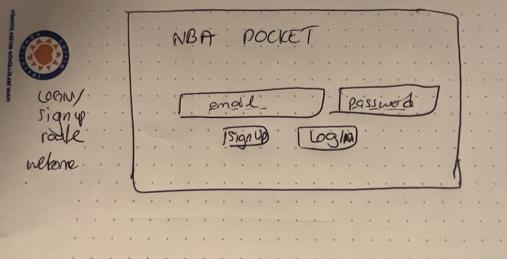
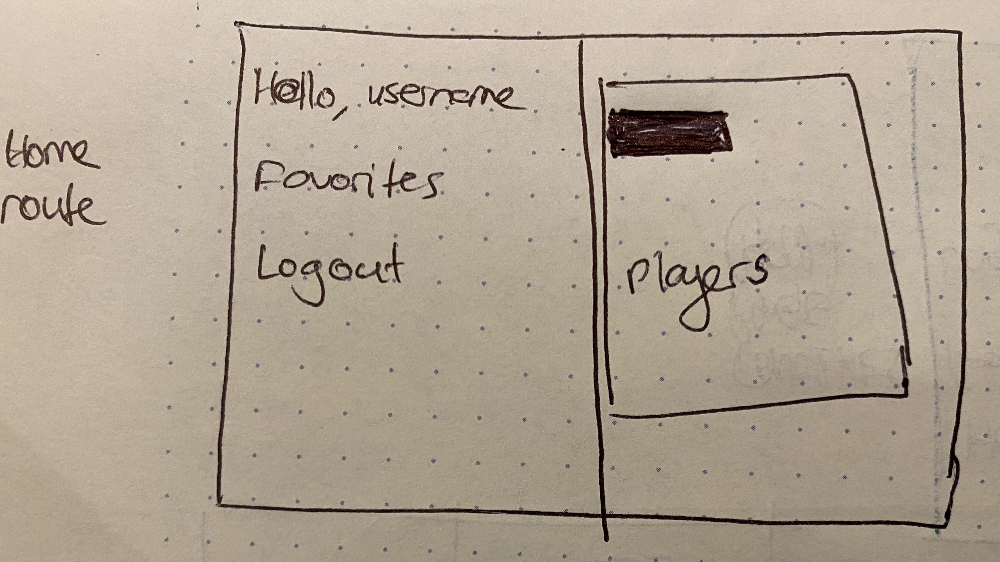
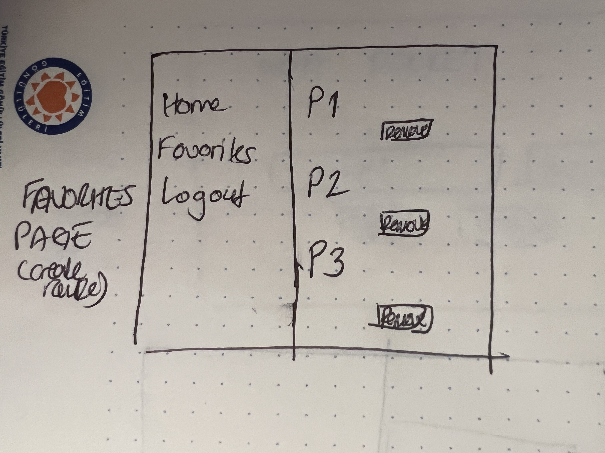
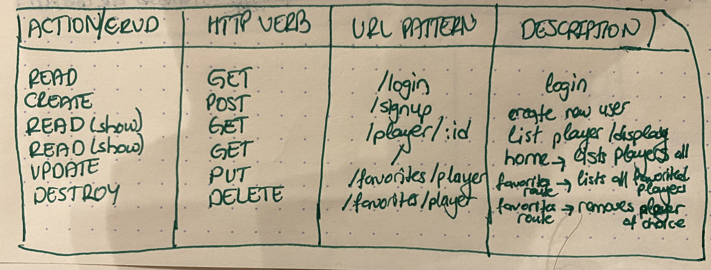
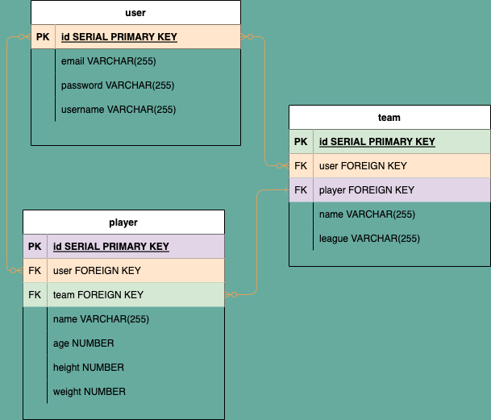

# NBA-POCKET 

# PROJECT IDEA AND PITCH
Now NBA players info are in your pocket to track and to favourite the players you pick.

# API
https://rapidapi.com/api-sports/api/api-basketball/
API KEY in .env

# TECH WILL BE USED
HTML, JS, CSS
node, express, axios

# USER STORIES
* I would like to select and get info on NBA players.
* I would like to create favorite NBA players and keep track on their info, and delete when I want to.
* I would like to display NBA player.

# WIREFRAMES

# RESTful ROUTES

# ERD

# MVP
* login / sign up route page getting rendered
* update ability for user info 
* home route page displays all players
* favorites route page displays favorited players
* show page displays specific player infos

