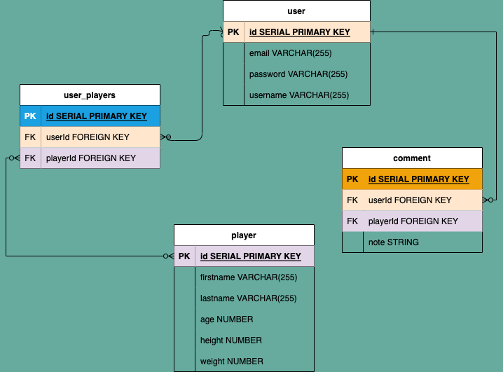

# NBA-POCKET 

# PROJECT IDEA AND PITCH
Now NBA players info are in your pocket to track and to favourite the players you pick.

# API
https://rapidapi.com/api-sports/api/api-nba
API KEY in .env

# TECH WILL BE USED
HTML, JS, CSS
node, express, axios, Postgres SQL

# USER STORIES
* I would like to search NBA Players by their name and get info on NBA players.
* I would like to create favorite NBA players and keep track on their info, and delete when I want to.
* I would like add note on comment section of favorites list.

# WIREFRAMES

# RESTful ROUTES

# ERD

# MVP
* login / sign up route page getting rendered
* update ability for user password(not functional at the moment, needs work on it)
* Profile route to search and display players by their firstname and have a favorites, logout option.
* able to add a player to your favorites and redirects to favorites page
* favorites route page displays all favorited players
* comments section on favorites list that you can add notes about your favorites list and edit/update your comments

